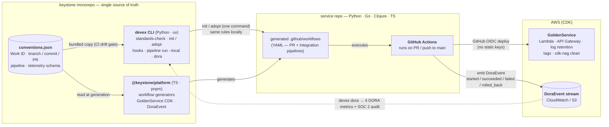

# Keystone — Shared Engineering Ecosystem

> A Golden Path for 10+ independent, full-cycle engineering teams. Keystone standardizes the SDLC so every team — regardless of stack or domain — follows the same engineering conventions and reports **comparable DORA metrics**.

This is a Proof of Concept. The focus is architecture, platform thinking, standardization, and developer experience — not feature completeness.

> **Reviewing this submission?** Start at **[SUBMISSION.md](SUBMISSION.md)** — a ~30-minute guided reading path with the challenge-to-deliverable map, the evidence index (real CI runs, real AWS deploy), and an honest account of what's open.

## The core idea

We don't standardize the *metric*. We standardize the *source of the metric*.

The framework owns CI/CD workflow generation, so every team emits an **identical, language-agnostic telemetry event** on every deploy — whether the service is Python, Go, Clojure, or TypeScript. DORA metrics are derived from that one event stream, which is why they're truly comparable. The same event is the SOC 2 audit record (who / what / when / why), with the **Work ID** (`FIN-123`) as the "why" link.

## Two distributable packages

| Package | Lang / tool | Role |
|---|---|---|
| [`devex` CLI](packages/devex-cli) | Python / `uv` | Developer-side. Local validation (shift-left), git workflow abstractions, project bootstrap. |
| [`@keystone/platform`](packages/platform-framework) | TypeScript / `pnpm` | Platform-side. Type-safe GitHub Actions generators, AWS CDK constructs, DORA telemetry contract. |

Both consume one **single source of truth**: [`conventions/conventions.json`](conventions/conventions.json) — Work ID, branch/commit/PR patterns, pipeline shape, telemetry schema. The CLI validates locally with the exact rules the generated CI enforces. Zero drift.

## The architecture — one source of truth, two consumers



The CLI and the framework **never import each other** — they integrate only through `conventions.json` and the documented `DoraEvent` schema. That's what lets each be versioned and Git-installed independently (ADR-0001), and what makes local validation and CI enforcement structurally incapable of drifting. Rejected alternatives, on purpose: per-team CI templates (drift by design) and conventions as policy documents (unenforced = optional).

## The proof: a real service adopted it

The integration case study is **[Transactionify](https://github.com/MauricioPereaA/transactionify)** — a payments API (Python Lambdas + API Gateway v2 + DynamoDB, with its own CDK app) that was **not** built for Keystone. It lives in its own public repo, and its CI history is the evidence:

- `devex adopt` brought in the golden path with **zero application-code changes** ([adoption PR](https://github.com/MauricioPereaA/transactionify/pull/1)).
- The first standardized CI run **caught 6 latent bugs** that the service's own — never-running — test suite had silently accumulated: [red (6 caught)](https://github.com/MauricioPereaA/transactionify/actions/runs/27232032733) → [green](https://github.com/MauricioPereaA/transactionify/actions/runs/27235803827), on the same PR.
- The generated pipeline **deployed it to a real AWS sandbox through GitHub OIDC** (no static keys) and emitted a real `DoraEvent`: [run 27309574910](https://github.com/MauricioPereaA/transactionify/actions/runs/27309574910).
- Every rough edge the adoption surfaced flowed back as **six reviewed platform fixes** (FIN-308 · 309 · 311 · 312/313 · 314 · 316) — the inner-source loop, demonstrated rather than promised.

Full narrative: [`docs/case-study-transactionify.md`](docs/case-study-transactionify.md).

## Install (directly from Git — no registry needed)

```bash
# CLI
uv tool install "git+https://github.com/MauricioPereaA/keystone#subdirectory=packages/devex-cli"

# Framework
pnpm add "github:MauricioPereaA/keystone#path:/packages/platform-framework"
```

## Repo layout

```
keystone/
├── .kiro/                     # Spec-Driven Development evidence
│   ├── steering/              #   persistent AI context (product, tech, structure, conventions)
│   └── specs/                 #   per-feature requirements / design / tasks
├── conventions/               # ★ single source of truth (CLI + framework consume this)
├── packages/
│   ├── devex-cli/             # Python CLI (uv)
│   └── platform-framework/    # TypeScript framework (pnpm)
├── docs/
│   ├── prd/                   # Product Requirements Documents
│   ├── architecture/adr/      # Architecture Decision Records
│   ├── engineering-rules/     # the engineering rulebook (conventions, security, SOC 2, AWS cost)
│   ├── consumption-guide.md   # how teams install / configure / extend / upgrade
│   └── contributing.md        # inner-source contribution guide
└── .github/workflows/         # dogfooding: Keystone runs its own generated pipelines
```

## Development workflow (Spec-Driven)

1. **Spec before code.** A PRD (`docs/prd/`) and, for technical forks, an ADR (`docs/architecture/adr/`) precede implementation, scaffolded from their templates.
2. **Steering files** (`.kiro/steering/`) hold persistent project context; **specs** (`.kiro/specs/`) drive each feature.
3. **Convention over configuration.** `devex init` generates a repo where the golden path is the default; the framework generates the workflows.
4. **Shift-left.** `devex standards-check` + git hooks fail fast on the workstation, with the same rules CI uses.
5. **Governance.** Conventional commits with Work ID, two-reviewer rule, no direct push to `main`.

## Per-package quickstart

```bash
# CLI
cd packages/devex-cli && uv sync --extra dev && uv run pytest

# Framework
cd packages/platform-framework && pnpm install && pnpm test && pnpm lint
```

## Implementation status

This is a PoC with deliberate scope decisions. Statuses are honest; every 🟡/⏭️ item is ticketed with an explicit trigger (see [SUBMISSION.md §Honest scope](SUBMISSION.md#honest-scope--open-edges-each-with-its-trigger-and-fix)).

| Capability | Status | Notes |
|---|---|---|
| `devex standards-check` · `check-pr-title` · `workid` | ✅ Real | Driven by `conventions.json` — no pattern hard-coded; property-based tested (Hypothesis) |
| `devex init` / `adopt` | ✅ Real | Scaffold + generated workflows; the reference adoption needed **zero app-code changes** |
| `devex hooks install` | ✅ Real | pre-commit + pre-push, the exact rules CI re-runs |
| `devex pipeline run --local` | ✅ Real | Simulates the pipeline before anything leaves the machine |
| `devex dora` | ✅ Real | All four DORA metrics; verified against events read back from CloudWatch on real AWS |
| PR-pipeline generator (small-tests → OIDC deploy) | ✅ Real | Ran live on a real service — sandbox deploy green via OIDC ([run 27309574910](https://github.com/MauricioPereaA/transactionify/actions/runs/27309574910)) |
| `GoldenService` CDK construct | ✅ Real | Deployed + destroyed on real AWS; cdk-nag clean; log retention, tags, `RemovalPolicy` enforced |
| `DoraEvent` telemetry contract | ✅ Real | TS emits, Python computes — one schema. CI emission lands in the run summary today; CloudWatch-sink wiring is the queued next PR |
| Language toolchains (Python · TS · Go · Clojure) | ✅ Real | All four generate (snapshot-tested); Python proven end-to-end on a live service |
| Integration pipeline (staging → production) | 🟡 Generated | Triggered live on `main`; promotion not run live (deliberate cost cap); merge-commit gate edge ticketed |
| Two-reviewer enforcement | ✅ Active | [`main-protection.json`](.github/rulesets/main-protection.json) applied to `main`: 2 approvals + required checks, no force-push (admin bypass recorded) |
| Post-deploy schemathesis fuzzing | ⏭️ Queued | Second half of FIN-314; lands with the CloudWatch-sink wiring |
| Configurable trunk branch | ⏭️ Queued | Trigger already observed once (a consumer's trunk was `master`) |
| **Bonuses A–E** | ✅ Real | LocalStack dev env · git hooks · Amazon Q reviews (live on [PR #17](https://github.com/MauricioPereaA/keystone/pull/17)) · Integration-pipeline generator · Kiro steering/specs |

## Documentation

- **Architecture & strategy (2-page ADR PDF):** [`docs/architecture/keystone-strategy.pdf`](docs/architecture/keystone-strategy.pdf) — the two-page overview (architecture diagram + homologation / scalability / shift-left strategies + migration triggers). Source: [`keystone-strategy.md`](docs/architecture/keystone-strategy.md).
- **Architecture Decision Records:** [`docs/architecture/adr/`](docs/architecture/adr/) (0001 monorepo · 0002 DORA source · 0003 git governance · 0004 prebuilt dist).
- **Consumption guide:** [`docs/consumption-guide.md`](docs/consumption-guide.md)
- **Contribution (inner-source) guide:** [`docs/contributing.md`](docs/contributing.md) — incl. governance: RFC process, maintainer rotation, deprecation policy.
- **Reviewer's guide (challenge submission):** [`SUBMISSION.md`](SUBMISSION.md)
- **Integration case study (real adoption):** [`docs/case-study-transactionify.md`](docs/case-study-transactionify.md)
- **AWS conventions & cost guardrails:** [`docs/engineering-rules/aws-cdk.md`](docs/engineering-rules/aws-cdk.md)

## License

MIT — see [LICENSE](LICENSE). Both packages (`devex-cli`, `@keystone/platform`) ship under the same license.
