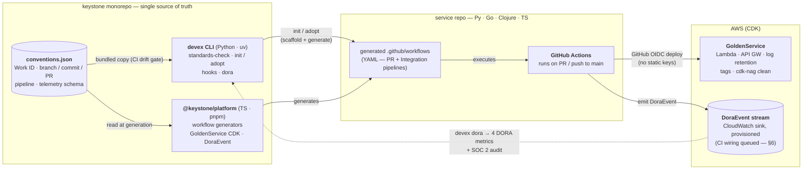

# Keystone — Architecture & Platform Strategy

*We don't standardize the metric — we standardize the **source** of the metric.*

**Mauricio Perea** · mauriceperea93@gmail.com · 2026-06-10 · Status: Final · decision records: ADR-0001…0004

**2 Git-installable packages · 117 tests (86 py + 31 ts) · 4 ADRs · live OIDC deploy on real AWS · 6 inner-source fixes from one real adoption**

**The problem.** 10+ independent full-cycle teams reinvent CI/CD, infrastructure, and conventions per repo. DORA metrics are not comparable across stacks (Python, Go, Clojure, TypeScript), SOC 2 evidence is reconstructed by hand, and Developer Experience — the actual product of a platform team — is fragmented.

**The decision.** Build the Golden Path as two independently versioned, Git-installable packages — `devex` (Python CLI, `uv tool install`) and `@keystone/platform` (TypeScript framework, `pnpm add`) — wired to **one** source of truth (`conventions.json`) and **one** telemetry contract (`DoraEvent`). The packages never import each other; every convention a team must follow is defined once and structurally enforced everywhere — by the same file, at every layer. Comparability, governance, and audit become structural properties, not policies teams are asked to remember.

## 1. Architecture



**Key properties.** The CLI and the framework integrate **only** through `conventions.json` and the documented event schema — no code dependency in either direction, which is what keeps both Git-installable on independent SemVer lines (`cli-vX.Y.Z` / `framework-vX.Y.Z`, ADR-0001). The CLI is self-contained: it bundles a synced copy of `conventions.json` (Pydantic-validated on every load; a CI gate fails on drift). Because the **framework** — never the application — generates CI and emits telemetry, every team's pipeline and every team's events are identical by construction (ADR-0002).

## 2. Homologation — adoption is engineered, not requested

| Lever | Mechanism |
|---|---|
| **One-command adoption** | `devex init` (new service) / `devex adopt` (existing) drop in the generated PR + Integration pipelines, PR template, and `keystone.json`; git hooks are an explicit opt-in (`devex hooks install`). The reference adoption: **zero application-code changes; the first standardized CI run caught 6 latent bugs**. |
| **One definition, two consumers** | Every convention — Work ID (`FIN-123`), branch/commit/PR patterns, pipeline stages, telemetry vocabulary — exists once in `conventions.json`. No regex is duplicated in Python or TypeScript; the CLI validates locally with **exactly** the rules the generated CI re-runs. Drift is structurally impossible, not reviewed away. |
| **Identical pipelines by construction** | Generated `small-tests` (unit + property-based + server-less OpenAPI schema validation), OIDC deploy stages, and `DoraEvent` emission are the same shape for every language behind one `LANGUAGE_TOOLCHAINS` interface. |
| **Governance as code** | Conventional commits anchored to a Work ID; PR-title gate; two-reviewer rule shipped as a version-controlled GitHub ruleset (ADR-0003) — change-management evidence an auditor can query. |

**Rollout for 10+ existing teams:** cohort-based — start with the highest-traffic repo per language family; `devex adopt` touches no application code and is mergeable in a single PR mid-sprint. The forcing function is the DORA dashboard itself: a team that hasn't adopted has no metrics to show, and visibility is the incentive. **Anti-patterns rejected:** per-team CI templates (drift by design), conventions as policy documents (unenforced = optional), per-language metrics SDKs (defeats comparability — ADR-0002), and golden paths harder to follow than to bypass (a platform bug, not a teams problem).

## 3. Scalability — the platform team is not in the critical path

- **Self-serve extension.** Languages live behind one typed interface; the `/new-language` recipe makes adding a stack a contracts-only contribution — no platform-team gatekeeping for the common case.
- **Inner-source, proven not promised.** One real adoption surfaced **six platform gaps** — install, toolchain, contract-testing, CI-checkout, and deploy-job defects — each fixed as a small reviewed PR to the platform (FIN-308, 309, 311, 312/313, 314, 316). Three were findable **only** by running the pipeline live. The next team inherits every fix.
- **Distribution that scales without a registry.** Pinned Git tags are the release artifact. The framework ships a **prebuilt `dist/`** (ADR-0004) — no build-on-install, no package-manager allowlists (pnpm ≥ 11.5 blocks git-dep build scripts) — with a CI freshness gate so the committed artifact can never drift from source.
- **The platform team's actual job:** own two contract points — `conventions.json` and the `DoraEvent` schema — curate contributions, run the release line. Everything else (workflow YAML, construct props) is consumer-readable and PR-able by any engineer; known edge cases are tracked as public, ticketed issues (§6). Not the job: writing or debugging per-team CI.

## 4. Shift-left — the same rules at four layers

1. **Workstation:** `devex standards-check` + opt-in git hooks fail in seconds, with the exact rules CI enforces — and the failure tells the developer how to fix it:
```text
$ devex standards-check
✓ branch OK
✗ commit invalid: 'update stuff'. Expected e.g. 'feat(api): FIN-123 add payment validation'
```
2. **Pre-push:** `devex pipeline run --local` simulates the pipeline before anything leaves the machine.
3. **PR pipeline (generated):** re-runs the conventions gate, unit + property-based tests, and validates the OpenAPI schema **server-less** — contract checking is split: schema pre-deploy, fuzz the deployed URL post-deploy (FIN-314). *Pre-deploy live-fuzzing is an anti-pattern: the endpoint doesn't exist yet.*
4. **Deploy:** GitHub **OIDC** (no static keys, least-privilege role scoped to the repo) → sandbox → staging → production promotion, each stage emitting telemetry.

Keystone dogfoods its own gate: the monorepo's CI runs the same conventions checks and drift gates it ships to adopters.

## 5. DORA & audit — one event, two consumers

Every generated deploy stage emits one `DoraEvent` — required fields `event, workId, actor, repo, env, commitSha, commitTime, timestamp` (the four W's, Work ID as the auditable "why"; `runId` as optional correlation). All **four DORA metrics are computable today** — deployment frequency, lead time (`timestamp − commitTime`), change-failure rate, MTTR — by `devex dora` over the stream, never instrumented per language. The same row is the SOC 2 record (CC6.1, CC7.2/7.3, CC8.1): evidence collection is a query, not an interview. **Proven on real AWS:** the framework's TypeScript `buildEvent`/`serializeEvent` produced the events, they were round-tripped through the construct-provisioned CloudWatch log group, and the Python CLI computed the four metrics from the read-back stream — TS contract, Python consumer, one schema. The case-study service deployed through OIDC from CI ([public run 27309574910](https://github.com/MauricioPereaA/transactionify/actions/runs/27309574910)), emitting its real `deployment.succeeded`; routing that CI emission into the CloudWatch sink is a queued trigger (§6).

## 6. When to reconsider — explicit migration triggers

- **Committed `dist/` → registry publish** [ADR-0004] — the day a private registry is available; the freshness gate retires with it.
- **Trunk branch as a generator option** — fires when trunk divergence affects a second adopting service; the case study already hit it once (trunk named `master`, integration pipeline keyed to `main`).
- **Commit-gate on protected-branch pushes** — fires the first time a team's trunk run goes red on a GitHub merge commit; the fix is the FIN-313 skip applied to the trunk (queued, ticketed).
- **CI events → CloudWatch sink + post-deploy fuzzing** — fires when the first team consumes `devex dora` from the shared stream rather than from run summaries; the sink is already provisioned by `GoldenService`.

---

> **Appendix — measured impact (Transactionify case study).** *Before:* no CI ever ran its tests · suite drifted from its own code · conventions unenforced · deploys manual. *After (zero app-code changes):* 6 latent bugs caught on the first standardized run, red → green on one PR · 6 platform gaps fixed upstream · real AWS sandbox deploy from CI via least-privilege OIDC, verbatim `DoraEvent` captured · four DORA metrics computed from the real stream · teardown verified to zero resources under a $5 budget alarm. Full narrative: `docs/case-study-transactionify.md`.
